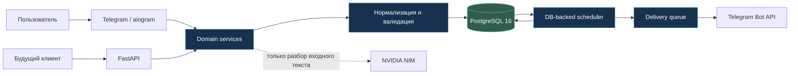

# Seshat — AI-assisted персональный диспетчер планов

[](https://github.com/krasnov01012/seshat-ai-planner/actions/workflows/ci.yml)


Seshat превращает планы на естественном языке в проверяемые записи, напоминает
о них по расписанию и хранит состояние так, чтобы перезапуск процесса не приводил
к потере или дублированию уведомлений. Telegram-бот — первый клиент; бизнес-логика
вынесена в самостоятельный domain-слой и доступна через FastAPI.

> Проект находится в активной разработке: это рабочий single-user прототип,
> а не завершённый массовый продукт.

## Текущая стадия

| Показатель | Состояние на 20 августа 2026 |
|---|---|
| Roadmap 1 / MVP | **4 из 8 этапов закрыто**, этап 4 в работе |
| Готово сейчас | создание записей, подтверждение, ручной fallback, расписание, тихие часы, таймзоны, кнопочные реакции |
| В работе | быстрые текстовые реакции и контекстная LLM-ветка |
| Проверки | **232 теста** в 18 модулях, Ruff и format-check |
| CI | PostgreSQL 16, миграции `up → down → up`, lint, tests |
| Масштаб | один пользователь, self-hosted deployment |

### Что уже работает

- создание событий, задач и рутин из обычного русского текста;
- строгий structured output: Pydantic-схема и бизнес-валидация перед записью;
- карточка подтверждения и полностью ручная форма без зависимости от AI;
- PostgreSQL-backed scheduler с материализацией повторений и идемпотентной доставкой;
- тихие часы, беззвучные ночные уведомления и утренний recap;
- корректная смена таймзоны: рутины следуют за местным временем, события сохраняют момент;
- реакции `Выполнено`, `Через час`, `Перенести`, `Пропустить` и защита от повторной обработки;
- одинаковые domain-операции из Telegram и HTTP API.

### Честные ограничения текущей версии

- свободные текстовые ответы на уведомления ещё не завершены;
- списки, дайджесты, статистика и правки записей текстом запланированы на следующий этап;
- семидневная production-приёмка и Google Calendar ещё впереди;
- регистрация нескольких пользователей и продуктовые лимиты относятся ко второму roadmap.

## Архитектура



Ключевая граница: AI участвует только во входном разборе. Доставка уведомлений
не зависит от модели и восстанавливается из PostgreSQL после перезапуска.

Подробности: [архитектура и инварианты](docs/ARCHITECTURE.md),
[выбор AI-моделей и замеры](docs/AI_MODELS.md).

## Два roadmap — кратко

### Roadmap 1: надёжный персональный MVP

1. ✅ Каркас, схема данных и API-first domain.
2. ✅ Создание записей через AI или ручную форму.
3. ✅ Надёжные уведомления, тихие часы и таймзоны.
4. 🟡 Реакции на уведомления — детерминированные действия готовы, текстовая ветка в работе.
5. ⬜ Представления дня, дайджесты, статистика и редактирование.
6. ⬜ Семидневная эксплуатационная приёмка.
7. ⬜ Односторонний экспорт в Google Calendar.

### Roadmap 2: развитие в продукт

- гибкие рутины и планирование нагрузки;
- объяснимая статистика без передачи вычислений модели;
- двусторонняя синхронизация с календарём;
- observability, rate limiting и защита от prompt injection;
- multi-user onboarding, экспорт и удаление данных.

Полная компактная версия: [docs/ROADMAP.md](docs/ROADMAP.md).

## Инженерные решения

- **API-first.** `domain` не импортирует `aiogram` или `fastapi`; адаптеры остаются тонкими.
- **Время только tz-aware.** Моменты хранятся в UTC, исходная таймзона и local time сохраняются.
- **Долговечное расписание.** Уведомления — строки в БД с уникальными ключами, а не задачи в памяти.
- **Недоверие к LLM.** Модель извлекает поля, код определяет тип записи и проверяет ограничения.
- **Безопасный fallback.** Если AI недоступен, пользователь продолжает через ручную форму.
- **Секреты вне Git.** Репозиторий содержит только пустой `.env.example`; логи редактируют токены.

## Стек

| Область | Технологии |
|---|---|
| Backend | Python 3.12, FastAPI, Pydantic 2 |
| Telegram | aiogram 3, FSM |
| Data | PostgreSQL 16, SQLAlchemy 2 async, Alembic |
| Scheduling | RRULE, DB-backed tick loop, `time-machine` |
| AI | NVIDIA NIM, JSON Schema, retries + fallbacks |
| Delivery | Docker Compose, GitHub Actions |
| Quality | pytest, Ruff, migration round-trip |

## Структура проекта

```text
src/seshat/
├── domain/      # бизнес-правила и use cases
├── db/          # модели и async persistence
├── api/         # FastAPI-адаптер
├── telegram/    # presenters, FSM, keyboards
├── scheduler.py # материализация и доставка
└── bot.py       # сборка Telegram-приложения

alembic/         # миграции PostgreSQL
tests/           # unit, integration и contract tests
tools/           # воспроизводимые AI-бенчмарки
docs/            # архитектура, roadmap, результаты выбора модели
```

## Локальный запуск

Требования: Docker, Docker Compose и свободные локальные порты `5433` и `8082`.

```bash
cp .env.example .env
# Заполните локальные значения; .env игнорируется Git.
docker compose up -d --build
docker compose exec api alembic upgrade head
```

Проверка готовности и OpenAPI:

```bash
curl -s http://127.0.0.1:8082/ready
# http://127.0.0.1:8082/docs
```

Проверки проекта:

```bash
uv sync --frozen
uv run ruff check .
uv run ruff format --check .
uv run pytest
```

Тесты используют отдельную PostgreSQL и не обращаются к Telegram или NVIDIA.

## Безопасность

- реальные токены, API keys, OAuth credentials и пароли не хранятся в репозитории;
- `.env`, key-файлы, дампы и benchmark output исключены через `.gitignore`;
- API по умолчанию публикуется только на `127.0.0.1`;
- protected endpoints требуют Bearer token;
- production-конфигурация и инфраструктурные адреса намеренно не входят в публичный экспорт.

См. [SECURITY.md](SECURITY.md) перед развёртыванием.

## Авторство и AI-assisted development

Проект спроектирован и собран владельцем с использованием Claude Code и OpenAI Codex
как инструментов разработки. Архитектурные ограничения, критерии приёмки и финальные
решения контролируются владельцем; результаты подтверждаются тестами, CI и явными
инвариантами. Формулировка намеренно отражает AI-assisted процесс без завышения навыков.
