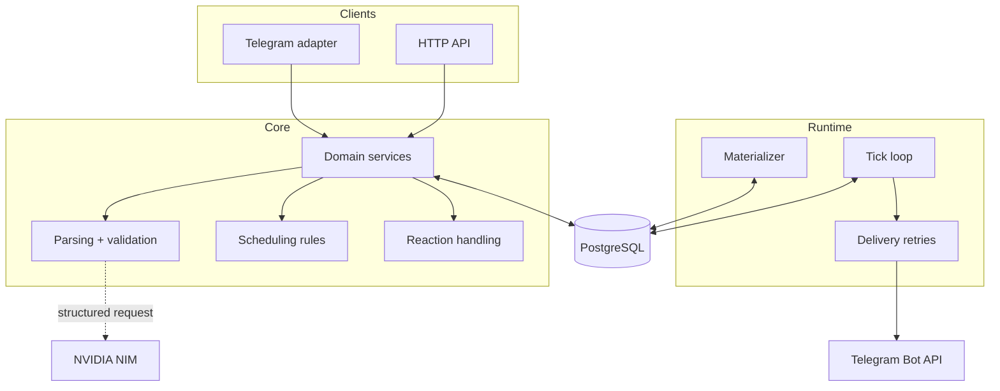

# Архитектура Seshat

## Цель

Seshat отделяет персональное планирование от конкретного интерфейса. Telegram —
первый адаптер, FastAPI — программный интерфейс, а все бизнес-правила находятся
в `src/seshat/domain`.

## Компоненты

## Поток создания записи

1. Адаптер передаёт текст, текущую дату и таймзону в domain.
2. NIM возвращает данные по JSON Schema; свободный ответ модели не попадает в БД.
3. Pydantic и бизнес-правила нормализуют даты, ограничения и reminders.
4. Тип записи выводит код по фактическим полям, а не LLM.
5. Пользователь видит карточку и явно подтверждает сохранение.
6. При недоступности AI тот же контракт собирается ручной FSM-формой.

## Поток доставки

1. Materializer раскрывает повторения в конечный горизонт.
2. Scheduler создаёт строки уведомлений с уникальным ключом.
3. Tick loop забирает due-строки с блокировкой и фиксирует попытку.
4. Delivery отправляет уведомление и сохраняет результат или retry.
5. После рестарта все незавершённые действия восстанавливаются из PostgreSQL.

AI не входит в этот путь: сбой модели может задержать разбор новой фразы, но не
должен останавливать уже запланированное уведомление.

## Основные сущности

| Сущность | Назначение |
|---|---|
| `users`, `user_settings` | пользователь, таймзона, quiet hours, defaults |
| `entries` | событие, задача или рутина |
| `occurrences` | конкретный экземпляр повторяющейся записи |
| `notifications` | физическая попытка напоминания и её статус |
| `active_context` | привязка ответа к последнему уведомлению |
| `entry_drafts` | подтверждаемое состояние до записи |
| `ai_calls` | метаданные вызовов модели без секретов |
| `audit_log`, `tz_changes` | история изменений и смен таймзоны |

## Инварианты

- `domain` не зависит от `aiogram` и `fastapi`.
- Все моменты времени tz-aware и хранятся как `timestamptz` в UTC.
- Каждая пользовательская таблица содержит `user_id`.
- `UNIQUE (occurrence_id, fire_at_utc, kind)` защищает от дублей уведомлений.
- Уже отправленные уведомления не пересчитываются при смене таймзоны.
- Рутины сохраняют local time; разовые события сохраняют абсолютный момент.
- Ни одна настройка настойчивости не включает звук в quiet hours.
- Ручная форма и кнопочные реакции не вызывают AI.
- Любое изменение через естественный язык требует разрешить неоднозначность.

## Границы безопасности

- Секреты загружаются только из окружения и представлены `SecretStr`.
- Конфигурация не разрешает пустой Bearer token для protected API.
- Логирование редактирует Telegram-, NVIDIA- и Bearer-подобные значения.
- Публичный пример связывает API и PostgreSQL только с loopback-интерфейсом хоста.
- Production ingress, адреса и credentials не являются частью этого репозитория.
